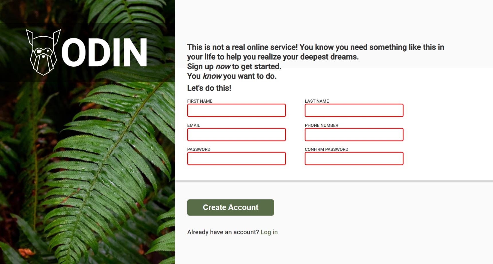

# Odin Signup Form

> This is a project about some semantic html elements and css elements.



Additional description of the project and its features.

## Built With

- Html5 elements,
  - `fieldset`, `img`, `div`, `section`, `button`
- Css,
  - `input:invalid`, `height`, `flex-direction`, `justify-content`
  - `display`, `font-weight`, `width`, `border`
- Linters
  - [prettier](https://prettier.io/)
  - [stylelint](https://stylelint.io/)

## Live Demo

[Live Demo Link](https://livedemo.com)

### Development (Running locally)

- Clone the project

```bash
git clone https://github.com/bolah2009/html-css-template.git

```

- Install Dependencies

```bash
yarn install
```

To run StyleLint by itself, you may run the lint task:

```bash
yarn lint:check
```

Or to automatically fix issues found (where possible):

```bash
yarn lint
```

You can also check against Prettier:

```bash
yarn format:check
```

and to have it fix (to the best of its ability) any format issues, run:

```bash
yarn format
```

You can also check against HTML Validator (htmlhint):

```bash
yarn lint:html
```

To generate an accessibility report for this webpage, run the below command, it uses axe:

```bash
yarn axe
```

## Style Guides

- [CSS Style Guide](http://udacity.github.io/frontend-nanodegree-styleguide/css.html)
- [HTML Style Guide](http://udacity.github.io/frontend-nanodegree-styleguide/index.html)
- [JavaScript Style Guide](http://udacity.github.io/frontend-nanodegree-styleguide/javascript.html)
- [Git Style Guide](https://udacity.github.io/git-styleguide/)
- [AXE Accessibility Style Guide](https://dequeuniversity.com/rules/axe/html/4.7)

## 👤 Author

- Github: [Gbemisola19](https://github.Gbemisola19)
- Twitter: [OladipoAzeezat](https://twitter.com/OladipoAzeezat)

## 🤝 Contributing

Contributions, issues and feature requests are welcome!

Feel free to check the [issues page](../../issues).

## Show your support

Give a ⭐️ if you like this project!

## Acknowledgments

- Odin project logo
  - https://cdn.statically.io/gh/TheOdinProject/curriculum/5f37d43908ef92499e95a9b90fc3cc291a95014c/html_css/project-sign-up-form/odin-lined.png
- Background image
  - https://unsplash.com/photos/25xggax4bSA
- project link

  - https://www.theodinproject.com/lessons/node-path-intermediate-html-and-css-sign-up-form

- etc

## 📝 License

[MIT licensed](./LICENSE).
